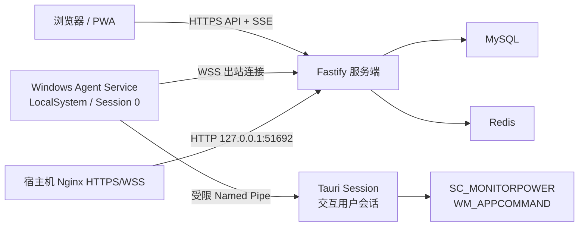

# Remote Control Hub

Remote Control Hub 是一个面向多用户的自托管 Windows 设备远程控制平台。它由 Web 管理端、Fastify 服务端以及 Windows Agent 组成，通过明确的命令白名单提供关闭显示器、系统音量和媒体播放控制，而不暴露任意命令执行、远程桌面或文件传输能力。

> [!IMPORTANT]
> 当前版本为 `0.1.0`，适合开发、集成测试和受控环境验证。正式部署前仍需准备域名、TLS、数据库备份、干净 Windows 虚拟机和真实硬件验收环境。Windows 发行物不进行 Authenticode 签名，安装时可能出现“未知发布者”或 SmartScreen 警告。

## 目录

- [主要特性](#主要特性)
- [系统架构](#系统架构)
- [安全模型](#安全模型)
- [技术栈](#技术栈)
- [仓库结构](#仓库结构)
- [环境要求](#环境要求)
- [开始开发](#开始开发)
- [服务端配置](#服务端配置)
- [生产部署](#生产部署)
- [首次安装](#首次安装)
- [Windows Agent](#windows-agent)
- [Web App 与更新机制](#web-app-与更新机制)
- [API 与协议](#api-与协议)
- [测试与质量门禁](#测试与质量门禁)
- [运维](#运维)
- [已知限制](#已知限制)
- [贡献](#贡献)
- [安全问题](#安全问题)
- [许可证](#许可证)

## 主要特性

### 设备与远程控制

- 每位用户独立注册、查看和控制自己的 Windows 设备。
- 设备显示名称使用 Windows 计算机名，身份使用服务端设备 ID 与设备公钥。
- 支持单设备和最多 100 台设备的批量操作。
- 支持以下白名单命令：
  - `display.turn_off`
  - `media.volume_up`
  - `media.volume_down`
  - `media.volume_mute_toggle`
  - `media.play_pause`
  - `media.previous_track`
  - `media.next_track`
  - `media.stop`
- 命令具有过期时间、批次幂等键、逐设备状态、设备内 FIFO 和持久去重记录。
- Agent 在外部 Windows API 调用后、结果持久化前崩溃时返回 `outcome_unknown`，不会自动重复潜在副作用。

### 账号与安全

- 支持规范化邮箱或 E.164 国际手机号作为唯一登录标识。
- 角色固定为 `admin` 和 `user`。
- 管理员可以管理用户、注册策略、设备治理和系统审计，但不能控制其他用户的设备。
- 密码使用 Argon2id 保存。
- 浏览器会话只存储于 Redis，并具有空闲过期、绝对过期、轮换与即时撤销能力。
- 支持可选 Passkey、TOTP 两步验证和一次性恢复码。
- 高风险管理员操作要求最近强认证和绑定具体操作的一次性确认令牌。
- 会话页展示 IP、GeoIP 大致位置和 User-Agent 推测信息，并明确标记这些结果可能不准确。

### Web 管理端

- 提供首次安装、登录、设备、命令、审计、会话和安全设置界面。
- 提供管理员用户治理、注册策略、全局设备治理和服务状态界面。
- 响应式支持桌面、移动浏览器和安装后的 PWA 模式。
- 使用 Font Awesome Free SVG，未引入 icon font、Kit 或远程图标资源。
- 日期和时间通过带时区的 ISO 8601 字符串传输，并按浏览器本地时区显示。

### 部署与发布

- Docker Compose 集成服务端、MySQL 和 Redis，应用通过宿主机回环地址的 HTTP `51692` 端口提供服务。
- 宿主机 Nginx 负责 HTTPS/WSS、证书、安全响应头和反向代理，仓库提供可直接调整的配置示例。
- GitHub Actions 执行格式、lint、类型、测试、构建、依赖审计、契约漂移和 Windows MSI 检查。
- 服务端镜像由受保护的部署工作流构建并直接通过 SSH 传到目标服务器，不使用容器注册表。
- Windows 发行物明确标记为未签名，并同时提供 SHA-256、构建元数据和 GitHub provenance。
- Windows 客户端只提示新的 GitHub Release，不自动下载、静默安装或自替换。

## 系统架构



Windows Agent 使用双进程模型：

- `agent-service.exe` 作为 LocalSystem Windows Service 运行，负责设备身份、注册、WSS、命令日志和安全路由。
- `agent-session.exe` 以当前用户标准权限运行，负责托盘、按需 WebView2 UI、显示器和媒体操作。
- 两个进程只通过带 DACL、身份校验、长度限制、版本握手和 generation 的 Named Pipe 通信。
- Agent 只建立出站 WSS，不在设备上监听公网端口。

## 安全模型

Remote Control Hub 将远程控制限制在固定协议和明确授权范围内：

- 不提供 shell、PowerShell、任意进程启动、脚本上传或通用键鼠控制。
- 所有公网通信必须使用 HTTPS/WSS。
- 设备注册码短时有效、单次使用并绑定创建它的用户。
- 设备私钥只保存在 Windows Agent，使用机器范围 DPAPI 和文件 ACL 保护。
- Agent 挑战签名采用固定算法、确定性载荷、域分离和单次 nonce。
- 浏览器 Cookie 使用 `Secure`、`HttpOnly` 和受限 `SameSite`，状态变更同时校验 Origin 和 CSRF token。
- Redis 不可用时拒绝会话认证，不降级到进程内或无状态会话。
- 管理员角色只增加治理权限，不绕过设备所有权校验。
- 最后一个可用管理员不能被禁用、删除或降级。
- Service Worker 只缓存公开应用壳，不缓存认证响应、设备、命令、审计或其他用户数据。
- 安装、升级、修复和卸载通过标准 MSI/UAC 流程提权；日常 Session/UI 不自提升。

## 技术栈

| 区域             | 技术                                                       |
| ---------------- | ---------------------------------------------------------- |
| 服务端           | Node.js 22、TypeScript、Fastify、TypeBox                   |
| 数据访问         | Drizzle ORM、MySQL 8.4                                     |
| 会话与认证中间态 | Redis 8.2                                                  |
| WebUI            | React 19、Vite 8、Tailwind CSS 4                           |
| PWA              | 自定义 TypeScript Service Worker、Cache Storage、IndexedDB |
| Windows Agent    | Rust 1.93、Tokio、windows-rs、Tauri 2                      |
| 安装器           | WiX Toolset 7、MSI、原生 Rust Bootstrapper                 |
| 反向代理         | 宿主机 Nginx                                               |
| 包管理           | pnpm 10 workspace、Cargo workspace                         |
| 测试与质量       | Vitest、ESLint、Prettier、Clippy、cargo-deny               |

## 仓库结构

```text
remote-control-hub/
├─ .github/workflows/       GitHub CI、客户端发布和服务端部署
├─ agent/
│  ├─ apps/                 Service、Session 和安装引导程序
│  ├─ crates/               Agent 核心、Wire、IPC 与 Windows 平台封装
│  └─ installer/wix/        机器级 WiX/MSI 定义
├─ api/
│  ├─ openapi/              生成的 HTTP OpenAPI 文档
│  └─ schemas/agent/        生成的 Agent JSON Schema
├─ apps/
│  ├─ server/               Fastify 服务端与 Drizzle 迁移
│  └─ web/                  React WebUI 与 Service Worker
├─ assets/                  应用图标的版本化 SVG 源文件
├─ deploy/                  Compose、Nginx 示例和运维脚本
├─ packages/
│  ├─ api-client/           类型安全的 Web API 客户端
│  ├─ contracts/            TypeBox 契约唯一源码
│  ├─ eslint-config/        共享 ESLint 配置
│  ├─ tsconfig/             共享 TypeScript 配置
│  └─ ui/                   无业务耦合的共享 UI 组件
└─ scripts/                 契约、PWA、图标和许可证检查脚本
```

## 环境要求

### 通用开发环境

- Git
- Node.js `22.22.1`
- Corepack 与 pnpm `10.30.3`
- Rust `1.93.0`
- `rustfmt`、`clippy`、`rust-analyzer`
- `x86_64-pc-windows-msvc` Rust target

版本已经固定在 `.node-version`、`package.json#packageManager` 和 `rust-toolchain.toml`。进入仓库后，rustup 会使用项目指定的工具链。

### Windows Agent 开发环境

- Windows 10 1809 x64 或更高版本
- Visual Studio 2022 Build Tools
- MSVC C++ 桌面构建工具和 Windows SDK
- Microsoft Edge WebView2 Evergreen Runtime
- .NET SDK 10，用于本地还原 WiX CLI 和验证 MSI

GitHub 托管 runner 可以完成编译和模拟测试，但不能替代 Windows 10/11 干净快照、显示器和媒体真实硬件验收。未签名安装包还需要覆盖 SmartScreen、“未知发布者”和企业应用控制策略下的实际安装行为。

### 服务端部署环境

- Linux `amd64`
- Docker Engine
- Docker Compose v2
- 域名及 DNS 控制权
- 可从公网访问的 80/443 端口
- 用于备份的 `age`、`gzip`、`tar` 和 MySQL 客户端工具

## 开始开发

### 1. 安装依赖

```bash
corepack enable
corepack prepare pnpm@10.30.3 --activate
pnpm install --frozen-lockfile
```

不要删除或绕过锁文件。`pnpm install` 会安装 Husky Git hooks。

### 2. 执行基础检查

```bash
pnpm format:check
pnpm lint
pnpm typecheck
pnpm test
pnpm build
```

### 3. 启动 WebUI 开发服务器

```bash
pnpm --filter @remote-control-hub/web dev
```

WebUI 开发服务器只提供前端资源，业务请求仍需要可访问的 Fastify 服务端。

### 4. 开发 Agent UI

只运行 React/Vite 前端：

```bash
pnpm --filter @remote-control-hub/agent-session dev
```

运行 Tauri 开发进程：

```bash
pnpm --filter @remote-control-hub/agent-session tauri dev
```

Tauri 应用默认不预创建主窗口；托盘和本地 IPC 生命周期由 Rust 层管理。

### 5. 本地运行服务端

服务端不自动读取 `.env` 文件。请通过当前 shell、进程管理器或容器显式传入配置：

```bash
pnpm --filter @remote-control-hub/contracts build
pnpm --filter @remote-control-hub/server build
node apps/server/dist/index.js
```

默认监听 `0.0.0.0:51692` 并以 `standalone` 安装模式启动。若需要由服务端同时提供 WebUI，应先构建 WebUI 并设置 `WEB_ROOT` 指向 `apps/web/dist`。

## 服务端配置

### 基础配置

| 变量                 | 默认值        | 说明                                |
| -------------------- | ------------- | ----------------------------------- |
| `DEPLOYMENT_MODE`    | `standalone`  | `standalone` 或 `compose`           |
| `HOST`               | `0.0.0.0`     | HTTP 监听地址                       |
| `PORT`               | `51692`       | HTTP 监听端口                       |
| `RELEASE_ID`         | `development` | 当前不可变发布标识                  |
| `APP_ORIGIN`         | 未设置        | 无路径的 HTTPS Origin               |
| `COOKIE_SECRET`      | 未设置        | 至少 32 个字符的高熵随机值          |
| `COOKIE_SECRET_FILE` | 未设置        | 不存在时首次启动自动生成并持久化    |
| `WEB_ROOT`           | 未设置        | 构建后的 WebUI 目录                 |
| `MIGRATIONS_FOLDER`  | `./drizzle`   | Drizzle SQL 迁移目录                |
| `GEOIP_DATABASE`     | 未设置        | MaxMind City MMDB 文件路径          |
| `TRUSTED_PROXIES`    | 未设置        | IP/CIDR JSON 数组，仅信任已配置代理 |

### 状态与审计文件

| 变量                    | 默认位置                         | 说明                    |
| ----------------------- | -------------------------------- | ----------------------- |
| `SETUP_STATE_FILE`      | `./state/setup-state.json`       | 可恢复安装状态          |
| `SETUP_CONFIG_FILE`     | `./state/setup-config.json`      | Standalone 数据服务配置 |
| `SETUP_SECRET_FILE`     | `./state/setup-secret.json`      | 首次安装秘密摘要和期限  |
| `OPERATIONS_AUDIT_FILE` | `./state/operations-audit.jsonl` | 本地管理 CLI 审计日志   |

生产环境中的状态目录必须持久化，并只允许服务账号读写。

### MySQL

| 变量             | 说明                                    |
| ---------------- | --------------------------------------- |
| `MYSQL_HOST`     | MySQL 主机                              |
| `MYSQL_PORT`     | MySQL 端口，默认 `3306`                 |
| `MYSQL_DATABASE` | 应用专用数据库                          |
| `MYSQL_USER`     | 仅具有目标应用数据库 DDL/DML 权限的账号 |
| `MYSQL_PASSWORD` | 应用数据库密码                          |
| `MYSQL_TLS`      | 设置为 `true` 时启用 TLS                |

不要向应用账号授予全局、用户管理、`FILE`、`PROCESS` 或 `SUPER` 权限。

### Redis

| 变量             | 说明                                   |
| ---------------- | -------------------------------------- |
| `REDIS_HOST`     | Redis 主机                             |
| `REDIS_PORT`     | Redis 端口，默认 `6379`                |
| `REDIS_USER`     | 可选 Redis ACL 用户名                  |
| `REDIS_PASSWORD` | Redis 密码                             |
| `REDIS_DATABASE` | 逻辑数据库，默认 `0`，允许 `0` 至 `15` |
| `REDIS_TLS`      | 设置为 `true` 时启用 TLS               |

Redis 使用 AOF 和 `noeviction`。所有会话和认证中间态仍具有 TTL；Redis 数据丢失的安全结果是所有浏览器会话失效并要求重新登录。

### WebAuthn

| 变量               | 说明                                 |
| ------------------ | ------------------------------------ |
| `WEBAUTHN_RP_ID`   | 正式域名，例如 `control.example.com` |
| `WEBAUTHN_ORIGINS` | HTTPS Origin JSON 数组               |
| `WEBAUTHN_RP_NAME` | 可选显示名称                         |

`WEBAUTHN_RP_ID` 和 `WEBAUTHN_ORIGINS` 必须同时配置。Origin 必须位于 RP ID 或其子域名内。

生产 Compose 由 `APP_URL` 自动派生并透传 WebAuthn RP ID/Origin，同时只信任 Docker 私网中的宿主机 Nginx 转发。修改正式域名后必须重新部署，并需要重新注册与旧 RP ID 绑定的 Passkey。

### TOTP keyring

生产 Compose 使用 `TOTP_KEYRING_FILE`，文件不存在且尚无安装状态时会在首次启动自动生成。生成后的 keyring 位于持久化 `remote-control-hub-server-state` 卷，必须与数据库恢复点一起备份；安装状态已经存在时不会静默重建丢失的 keyring。

文件格式如下：

```json
{
  "currentVersion": 1,
  "keys": {
    "1": "<32 字节随机密钥的标准 Base64>"
  }
}
```

也可以在非容器环境同时配置 `TOTP_KEYRING` 和 `TOTP_CURRENT_KEY_VERSION`。不要同时使用文件和环境变量两种方式。

## 生产部署

### 服务器本地目录

假设 `DEPLOY_PATH=/opt/remote-control-hub`，首次部署会自动创建所需目录和运行配置：

```text
/opt/remote-control-hub/
├─ incoming/
├─ releases/
├─ shared/
│  └─ compose-secrets.env
└─ backups/
```

不需要手工创建 `production.env`。首次部署自动生成 MySQL 应用密码、MySQL root 密码和 Redis 密码，并以 `0600` 权限持久化到 `shared/compose-secrets.env`。服务端首次启动再自动生成 Cookie secret 和 TOTP keyring，并保存在 `remote-control-hub-server-state` 卷中。数据库名、数据库用户名、Redis 数据库编号和 HTTP 端口使用版本化的固定值。

`APP_ORIGIN`、WebAuthn RP ID/Origin、`SERVER_IMAGE` 和 `RELEASE_ID` 由部署工作流根据 `APP_URL` 与目标 commit 写入当前 release 的 `runtime.env`。这些文件由脚本维护，不应手工编辑。请为 `shared/compose-secrets.env`、`remote-control-hub-server-state` 和 MySQL 数据建立一致的加密备份；默认 Compose 未启用可选 GeoIP MMDB，缺少它只会让会话位置显示为未知，不影响认证。

### GitHub `production-deploy` Environment

所有配置都存为 Environment Secrets，不使用 Environment Variables：

| 名称                     | 示例或说明                                            |
| ------------------------ | ----------------------------------------------------- |
| `DEPLOY_SSH_PRIVATE_KEY` | 专用部署用户的 SSH 私钥                               |
| `DEPLOY_HOST`            | `203.0.113.10`                                        |
| `DEPLOY_PORT`            | `22`                                                  |
| `DEPLOY_USER`            | `remote-control-hub`                                  |
| `DEPLOY_PATH`            | `/opt/remote-control-hub`                             |
| `APP_URL`                | 稳定的 HTTPS Origin，如 `https://control.example.com` |

生产部署只能手动运行 `server-deploy.yml`，并经过 `production-deploy` Environment 审批。工作流确认目标 commit 已通过 CI 后构建 Linux `amd64` 镜像，将镜像与同 commit 的 deployment bundle 压缩、分别计算 SHA-256，并直接通过 SSH/SCP 传到目标服务器。服务器验证摘要后使用 `docker image load` 导入本地不可变标签，因此不需要 GHCR、镜像仓库账号或拉取凭据。

部署脚本先启动并等待项目专属 MySQL 与 Redis 容器健康，再读取安装和迁移状态；空服务器会继续进入受限首次安装模式，已安装服务器则先执行兼容迁移再切换应用容器。

工作流使用 `ssh-keyscan` 在每次部署时自动生成临时 `known_hosts`，因此不需要配置 `DEPLOY_SSH_KNOWN_HOSTS`。这种方式无法验证首次取得的主机密钥是否真实，不能抵御部署当时的 SSH 中间人攻击；若部署环境需要严格服务器身份校验，应恢复使用预先固定的 host key。

### Nginx 与 TLS

Compose 只把服务暴露在 `http://127.0.0.1:51692`，不会监听公网 80/443。复制并调整 `deploy/nginx.conf.example` 中的域名和证书路径，让宿主机 Nginx 代理到该地址。示例已经包含 WebSocket Upgrade、SSE 所需的禁用缓冲、长连接超时、安全响应头和 PWA CSP。

`APP_URL` 必须与浏览器最终访问的稳定 HTTPS Origin 完全一致。部署脚本由它自动生成 WebAuthn RP ID 和允许 Origin。Passkey 不需要单独申请证书，只需要该域名拥有浏览器信任的普通 HTTPS 证书；证书可以由 Certbot/Let's Encrypt 或你现有的 Nginx 证书流程免费签发。

### 未签名 Windows 发布

项目不配置 Windows 代码签名证书，也不需要 `code-signing` Environment、PFX Secret 或时间戳服务。`v*` 标签仍会构建 MSI 和 Bootstrapper，并发布名称带有 `unsigned` 的 ZIP、SHA-256 校验文件和 GitHub provenance。

GitHub Release、压缩包目录、`UNSIGNED_BUILD.txt` 和 `build-metadata.json` 都会明确标记产物未签名。用户应只从本仓库 Release 页面下载并在安装前核对 SHA-256。Windows 可能显示“未知发布者”或 Microsoft Defender SmartScreen 警告，企业应用控制策略也可能拒绝运行未签名程序。

WebView2 Bootstrapper 是独立的微软发行物。工作流仍校验该文件的 Microsoft Authenticode 签名和 SHA-256，再把摘要注入 Agent Bootstrapper；这不代表 Remote Control Hub 自身经过代码签名。

## 首次安装

未完成安装时，服务端只开放安装页、安装 API、`/healthz`、模式感知 `/readyz` 和非敏感版本元数据。登录、注册、设备、命令、审计和 Agent WSS 保持关闭。

### 1. 签发一次性安装秘密

安装秘密只能从服务器本地 CLI 签发。CLI 默认使用 600 秒有效期，并只输出原值一次：

```bash
node dist/cli/index.js setup-secret issue \
  --confirm ISSUE_SETUP_SECRET \
  --ttl-seconds 600
```

Compose 部署时应通过当前 release 的 `docker compose run --rm --no-deps remote-control-hub-server` 执行同一命令，以便使用 `remote-control-hub-server-state` 持久卷。不要把秘密写入部署日志、URL、浏览器持久存储或聊天记录。

### 2. 打开安装页

访问配置的 `APP_URL`：

- Compose 模式自动验证内部 `mysql` 和 `redis` 服务，不允许浏览器覆盖目标。
- Standalone 模式由安装者填写并分别测试 MySQL 和 Redis。
- 两个数据服务都通过服务端重新验证后才允许迁移。

### 3. 创建首个管理员

安装者输入一次性安装秘密，并创建唯一初始管理员。管理员使用正式密码，默认注册策略为 `closed`。Passkey 和 TOTP 是推荐但可跳过的后续设置。

安装完成后，安装写接口永久关闭且安装秘密失效。重新进入安装模式或修复数据库/本地状态不一致只能通过服务器本地 CLI，并应先建立有效备份。

### 管理 CLI

```text
setup-secret issue|rotate
setup status|reconcile
migration status|apply
totp-key rotate
```

高风险操作需要命令中规定的明确 `--confirm` 值。CLI 输出默认脱敏，并将管理操作写入本地运维审计文件。

## Windows Agent

### 支持范围

- Windows 10 1809 x64
- Windows 10 22H2 x64
- Windows 11 x64
- 单个日常使用的本地交互用户

### 构建 Rust workspace

```bash
cargo build \
  --manifest-path agent/Cargo.toml \
  --workspace \
  --locked \
  --release \
  --target x86_64-pc-windows-msvc
```

构建 Agent UI 静态资源：

```bash
pnpm --filter @remote-control-hub/agent-session build
```

还原仓库固定的 WiX CLI：

```bash
dotnet tool restore
```

MSI、Bootstrapper、WebView2 Bootstrapper 校验、SHA-256、provenance 和 Release 打包由 `client-release.yml` 完成。Remote Control Hub 的 EXE 与 MSI 保持未签名，压缩包名称和元数据会明确标注这一点。

### 注册设备

1. 用户登录 WebUI，为自己的账号创建设备注册码。
2. 用户从本仓库 Release 下载未签名 Windows 客户端，核对 SHA-256，并确认接受 Windows 的“未知发布者”或 SmartScreen 提示后完成安装。
3. 用户从托盘打开 Agent UI。
4. 用户输入并确认规范化的 HTTPS 服务 Origin、设备注册码。
5. Service 从 Named Pipe 客户端令牌独立核验 SID 与控制台 Session。
6. Service 生成机器设备密钥并向服务端注册，成功后绑定当前用户 SID。

更改服务 Origin 必须清除原绑定并重新注册。生产构建不接受 HTTP、证书错误或跨 Origin 重定向。

### Windows 权限模型

- `agent-service` 由 Service Control Manager 以 LocalSystem 自动启动。
- `agent-session` 使用 `asInvoker`，不自行提权。
- Session 登录启动项使用 HKLM `Run`。
- 不创建最高权限计划任务。
- 不调用 PowerShell、`pwsh.exe` 或 `cmd.exe` 作为提权机制。
- 本地绑定恢复只能由管理员从已提升终端显式执行已安装的 `agent-service` 程序。

## Web App 与更新机制

WebUI 可安装为 PWA。首次成功在线加载后，Service Worker 完整下载并校验当前应用壳，只有资源数量、大小、响应属性和 SHA-256 摘要全部正确时才建立第一个 active release。

后续启动采用缓存优先策略：

1. Service Worker 从 IndexedDB 读取 active release。
2. 导航请求优先返回已确认的本地应用壳。
3. 页面渲染后异步检查远端 `app-version.json`。
4. 新 release 下载到隔离的 staging cache。
5. 下载、完整性校验、API/Worker 协议兼容和候选启动都通过后才原子提升 active 指针。

更新下载可以取消。校验、存储或候选启动失败时，原 active release 保持不变。客户端不维护 `previous` 指针，不自动降级已激活版本，也不允许用户任意选择历史版本。

Service Worker 自身使用独立版本和生命周期：新 Worker 保持 `waiting`，只有兼容预检和用户确认后才激活。应用 release 改变不会自动改变 Worker 字节。

## API 与协议

- HTTP API 使用 `/api/v1` 前缀。
- HTTP 契约和 Agent WSS 契约的唯一源码位于 `packages/contracts`。
- HTTP OpenAPI 生成物位于 `api/openapi/openapi.json`。
- Agent JSON Schema 位于 `api/schemas/agent/v1`。
- WebUI 通过 `packages/api-client` 访问服务端，不直接依赖数据库实现。
- Rust Agent 使用生成的 JSON Schema 和跨语言 fixtures 验证兼容性。

健康检查：

| 端点                   | 语义                                            |
| ---------------------- | ----------------------------------------------- |
| `/healthz`             | 进程存活                                        |
| `/readyz`              | 当前模式就绪；安装模式与业务模式语义不同        |
| `/operationalz`        | 已安装且 MySQL、Redis、迁移和业务依赖全部可用   |
| `/api/v1/meta/version` | 非敏感 API、WebUI、Worker 与 release 兼容元数据 |

SSE 只发送轻量状态通知，不是权威数据源。断线、事件缺口或服务重启后，客户端重新查询对应设备、批次或命令；不支持 SSE 时使用可见性感知的 HTTP 轮询。

## 测试与质量门禁

### 常用命令

| 命令                                                | 内容                                           |
| --------------------------------------------------- | ---------------------------------------------- |
| `pnpm format:check`                                 | Prettier 和 Cargo fmt                          |
| `pnpm lint`                                         | ESLint、Cargo fmt、Clippy，警告视为错误        |
| `pnpm typecheck`                                    | TypeScript project references 严格类型检查     |
| `pnpm test`                                         | 全部 Vitest 与 Rust workspace 测试             |
| `pnpm build`                                        | TypeScript、Vite 与 Rust workspace 构建        |
| `pnpm contracts:check`                              | 重新生成 OpenAPI/JSON Schema 并检查漂移        |
| `pnpm pwa:check`                                    | Manifest、Worker、CSP、缓存和 release 清单检查 |
| `pnpm icons:check`                                  | 图标生成、格式、可见像素与漂移检查             |
| `pnpm licenses:check`                               | npm 生产依赖许可证策略                         |
| `pnpm audit --prod --audit-level high`              | npm 生产依赖高危漏洞审计                       |
| `pnpm --filter @remote-control-hub/server db:check` | Drizzle schema 与迁移状态                      |

Rust 供应链在 CI 中使用 `cargo-deny` 检查 advisories、licenses 和 sources。受控例外写在 `deny.toml`，必须包含原因和复核期限。

### Git hooks

Husky 和 lint-staged 在提交前检查适用的暂存文件：

- TypeScript/JavaScript/React：ESLint，警告视为错误。
- JSON/YAML/CSS/Markdown：Prettier。
- Rust：Cargo fmt 与 Clippy。

不要使用 `--no-verify` 绕过 hooks。CI 会从干净检出重新执行全量门禁。

### CI

`ci.yml` 覆盖：

- 格式、lint、类型、单元和集成测试。
- 契约、PWA、图标、数据库和许可证检查。
- npm 与 Rust 依赖安全检查。
- Docker `linux/amd64` 镜像构建。
- Windows Rust workspace、Tauri 前端和 MSI/ICE 验证。

CI 中不会真正关闭 GitHub runner 的显示器。Windows API 通过可替换边界测试，真实显示器、播放器和多显示器行为必须在独立硬件上验收。

## 运维

版本化脚本位于 `deploy/scripts`：

| 脚本                  | 用途                                                |
| --------------------- | --------------------------------------------------- |
| `deploy.sh`           | 校验 bundle、执行迁移、启动服务并切换 current 指针  |
| `rollback.sh`         | 恢复上一兼容 deployment bundle 与镜像               |
| `backup.sh`           | 停止写入路径并创建 Age 加密一致性备份               |
| `validate-backup.sh`  | 校验摘要、解密备份并在隔离 MySQL 中恢复验证         |
| `prune-backups.sh`    | 按保留策略清理备份                                  |
| `prune-releases.sh`   | 包含当前版本最多保留 3 个 release，并清理无引用镜像 |
| `verify-redis-aof.sh` | 验证 Redis AOF                                      |

新建备份使用格式 v2，通过 Age 分别加密 MySQL dump、服务端状态和 `compose-secrets.env`，再统一记录 SHA-256。验证脚本仍接受不含 Compose secrets 的历史 v1 备份。恢复私钥不应与生产数据库、备份文件或服务器放在同一信任边界。每个恢复点同时关联数据库、服务端状态、commit 和 schema 版本。

部署脚本只支持向前兼容迁移。应用回滚不会自动回滚数据库，因此每个 release 都必须声明并验证兼容的 schema 范围。

## 已知限制

- 不支持远程桌面、文件传输、任意命令、通用键鼠控制或内核驱动。
- 第一阶段假设设备只有一个日常使用的本地 Windows 用户。
- 不支持多用户快速切换、并行交互 Session、共享计算机或 RDP 控制。
- 多个交互 Session 会返回 `multiple_sessions_unsupported`，不会猜测目标用户。
- 不为创建时离线的设备排队命令；该目标立即返回 `device_offline`。
- `SC_MONITORPOWER` 和 `WM_APPCOMMAND` 的成功只表示 Windows API 已调用并收到 Agent 回执，不保证外设或播放器最终状态发生改变。
- 第一阶段服务端使用单 Node.js 实例和进程内 Agent 连接表，不支持连接层水平扩展。
- 设计容量基线为 1,000 台注册设备、500 条在线 Agent WSS 和 200 个活跃浏览器会话；扩大数量级前必须重新压测。
- Windows 客户端不自动更新，只提示固定 GitHub 仓库的新稳定 Release。
- 私有 GitHub Release 无法匿名检查；客户端不会内嵌 GitHub token。
- 浏览器可能清理 PWA 存储，因此离线应用壳是受缓存存续条件约束的能力。

## 贡献

1. Fork 仓库并从最新主分支创建功能分支。
2. 保持修改聚焦，不提交密钥、`.env`、数据库、备份或构建产物。
3. TypeScript 使用严格类型，优先使用 `type`，禁止 `any`。
4. 常量使用 `UPPER_SNAKE_CASE`，React 组件及文件使用 PascalCase。
5. 使用双引号和分号，不添加无必要注释。
6. 修改契约后运行 `pnpm contracts:check` 并提交对应生成物。
7. 修改图标源或 Worker 后运行对应 PWA/图标检查。
8. 提交前至少运行格式、lint、类型和相关测试。
9. 不绕过 Husky hooks。
10. Pull Request 中说明动机、影响范围、验证方式和安全影响。

新增依赖前应确认已有包管理器和锁文件，优先选择成熟、维护良好且许可证兼容的库。

## 安全问题

请不要在公开 Issue 中披露可利用的安全漏洞、凭据或真实用户数据。优先使用仓库的私密安全报告或 GitHub Security Advisory，并提供：

- 受影响版本或 commit；
- 最小复现步骤；
- 预期与实际行为；
- 潜在影响；
- 已知缓解方式；
- 不含真实秘密的日志或请求样本。

远程控制、身份验证、命名管道、安装提权、Service Worker 更新和部署脚本的修改都应视为安全敏感变更。

## 许可证

项目源码声明使用 `AGPL-3.0-only`。使用、修改或通过网络向用户提供修改后的服务时，请遵守 GNU Affero General Public License 3.0 的相应义务。

第三方依赖的许可证与归属信息见 `THIRD_PARTY_LICENSES.txt`。Font Awesome Free 图标按其免费许可证条款使用，正式发行物必须保留相应归属信息。
